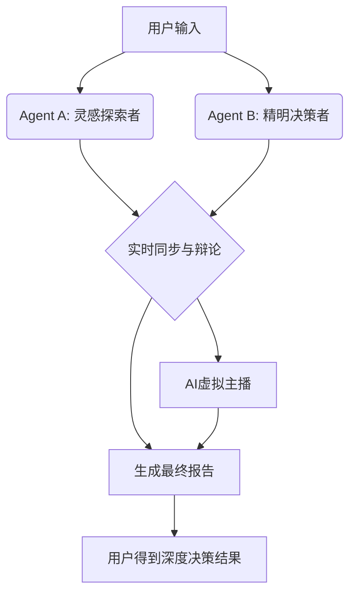

# NeuroSync
Real-time multi-agent orchestration system.

[](https://opensource.org/licenses/MIT)
[](https://www.python.org/downloads/)

> **Two AI minds, syncing in real-time to perform for you.**
> 不是工具，是智能剧场。我们导演了一场两个AI之间充满人格的、可被观赏的博弈。

## 核心哲学

在 AI 时代，技术会民主化，代码会趋同。真正让一个作品喷薄而出的，是你为它注入的 **人格** 与 **叙事**。`NeuroSync` 不做流水线式的任务处理，它构建了一个 **思维场**，让两个被赋予不同性格的 AI 智能体，像大脑的两个半球一样同步思考、对话、辩论，最终编织出远超个体的智慧之网。

## 快速开始

1.  **克隆仓库**
    ```bash
    git clone https://github.com/GY-GAVIN/NeuroSync.git
    cd NeuroSync
    ```

2.  **安装依赖**
    ```bash
    pip install -r requirements.txt
    ```

3.  **配置环境变量**
    复制示例文件，并填入你的 API 密钥。
    ```bash
    cp .env.example .env
    # 编辑 .env 文件，填入你的两个模型 API 及相关服务的 Key
    ```

4.  **运行应用**
    ```bash
    streamlit run app.py
    ```

## 系统架构


## 项目亮点
-   **双模型回环协作**：两个Agent通过"生成-批判-优化"的循环，产出单一模型无法企及的高质量结果。
-   **人格化智能体**：AI不再冷冰冰。"天马行空的探索者"与"毒舌本地专家"的对话，让思考过程充满戏剧张力。
-   **实时同步直播**：不是黑箱操作，前端界面实时展示两个AI的思维碰撞与决策过程。
-   **虚拟主播集成**：将AI的内心博弈，通过虚拟形象演出来，提供前所未有的交互体验。

## 演示脚本
在黑客松现场，我们推荐使用以下脚本进行演示：
-   **用户**："我想带女朋友去东京，预算8000，喜欢动漫和美食，但女朋友怕辣。"
-   **预期效果**：Agent A 提供大量灵感，Agent B 犀利筛选并吐槽，最终生成一份让情侣都满意的惊喜行程。
